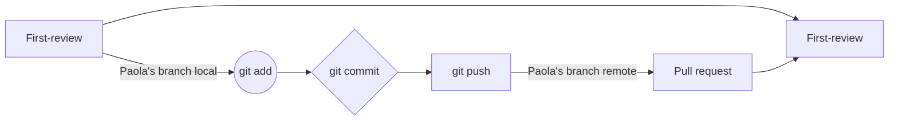

# Process Description 
## Team
- Paola - Collaborator
- Freddy - Collaborator
- Leonardo - Collaborator
- Juan - Collaborator
- Ronnie - Collaborator
- Alexander - Leader

## How do we work?
For this First review, we agreed to use the Kanban method as our agile methodology.

This method is very simple to use because it basically involves having a board with 5 columns that represent the workflow. We considered this method due to shecuchule’s team, while the Scrum method needed daily meething, Kanban is not rigid.

We planned to use a github project to define our tasks.

The goal was to define our tasks with help of issues, then use them in the GitHub Project.

### Kanban structure 
- **Backlog:** For task recent created
- **Ready:** For task ready to start
- **In progress:** For tasks that are being worked on
- **In review:** For tasks in review, which could be a pull request.
- **Done:** For approved tasks (once the pull request is done).

## Use of Git
We should use Git at all times with these rules:
We create a branch called -First-review- that contains the final result.
Everyone must create a branch with their respective name.
Nobody works in the main branch.
The use of GitKraken was recommended to facilitate understanding.
We should work in the command line (Git Bash, Warp, etc).

## Example of how Git is used

## File
The file-folder names must be typed with Pascal Case.

## Improvements

- Reinforce the use of git
- Reinforce the use of issue (description)
- Reinforce the use of GitHub Project
